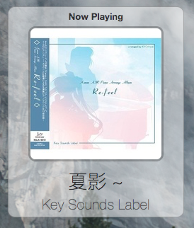

# Ubersicht-XiamiFM

Ubersicht Plugin for Displaying Xiami FM Now Playing in Google Chrome Canary.

这是一个虾米电台Ubersicht插件，可用于显示Google Chrome/Canary中正在播放的虾米电台曲目。

Screenshot:



# Usage

First, install Tampermonkey on your Chrome or Chrome Canary.

Install the following script into Tampermonkey:
```
// ==UserScript==
// @name         XiaFM
// @namespace    https://amayume.net/
// @version      0.1
// @description  Xiami FM Parser
// @author       ProfFan
// @match        http://www.xiami.com/radio/play/*
// @grant        none
// ==/UserScript==
/* jshint -W097 */
'use strict';

// Your code here...

//console.log(Fm_beforeplay);

window.Fm_beforeplay_backup = Fm_beforeplay;
Fm_beforeplay = function (a){
    var b = a;
    $.ajax ( {
        type:       'GET',
        url:        '/song/'+a.songId,
        dataType:   'JSON',
        success:    function (result) {
            var typ = document.createAttribute("data-nowplaying");
            var el = document.createElement( 'html' );
            el.innerHTML = result;
            b.cover_url = el.querySelector("#albumCover img").attributes["src"].value;
            
            typ.value = JSON.stringify(b);
            document.head.attributes.setNamedItem(typ);
        }
    } );
    
    return Fm_beforeplay_backup(a);
}
```

Then place the `.widget` directory into the widgets directory.

Enjoy!

# LICENSE

MIT
